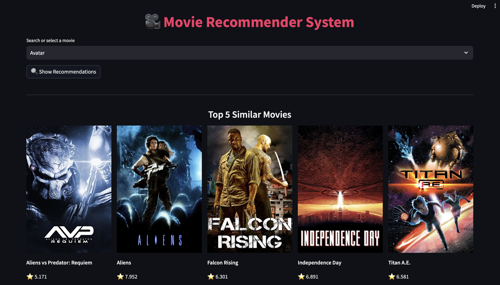

# 🎬 Movie Recommender System

A simple and interactive movie recommender system built with **Streamlit** and **TMDb API**, powered by **Machine Learning**. 

Users can select any movie and receive 5 similar recommendations with posters, genres, ratings, and descriptions.

---

## 🚀 Demo

🧪 Run locally:  
```bash
streamlit run app.py
```

---

## 📦 Features

- ✅ ML-based recommendation engine using cosine similarity
- 🎞️ Real-time poster & movie details from TMDb API
- ⚡ Fast and clean UI using Streamlit
- 🔍 Searchable dropdown for movie selection
- 🌐 Deploy-ready on AWS with Nginx & systemd support

---

## 🧠 How it Works

1. A precomputed similarity matrix is generated using movie features.
2. When a user selects a movie, the system:
   - Finds the most similar movies based on cosine similarity
   - Fetches their details from TMDb
   - Displays poster, title, genres, rating, and overview

---

## 🛠️ Installation

1. Clone the repo:
```bash
git clone https://github.com/luckyIITR/Movie-Recommender-System-Using-ML.git
cd Movie-Recommender-System-Using-ML
```

2. Create and activate a virtual environment:
```bash
python3 -m venv venv
source venv/bin/activate
```

3. Install dependencies:
```bash
pip install -r requirements.txt
```

4. Set up your `.env` file:
```env
TMDB_API_KEY=your_tmdb_api_key_here
```

5. Run the app:
```bash
streamlit run app.py
```

---

## 📁 Project Structure

```
Movie-Recommender-System-Using-ML/
├── artifacts/
│   ├── movie_list.pkl          # Pickled movie DataFrame
│   └── similarity.pkl          # Cosine similarity matrix
├── app.py                      # Main Streamlit app
├── requirements.txt            # Python dependencies
├── README.md                   # This file
└── .env                        # API key (not committed)
```

---

## 📌 Dependencies

- `streamlit`
- `requests`
- `python-dotenv`
- `pandas`
- `scikit-learn` *(if preprocessing used before pickle)*
- `pickle` (Python built-in)

---

## 🌐 Deployment Guide (AWS + Nginx + systemd)

1. SSH into your AWS instance:
```bash
ssh ubuntu@your-aws-ip
```

2. Clone or copy your project to the server.

3. Create and activate a virtual environment:
```bash
python3 -m venv venv
source venv/bin/activate
pip install -r requirements.txt
```

4. Test your app:
```bash
streamlit run app.py --server.port 8501 --server.headless true
```

5. Create a systemd service (`/etc/systemd/system/streamlit.service`):
```ini
[Unit]
Description=Streamlit App
After=network.target

[Service]
User=ubuntu
WorkingDirectory=/home/ubuntu/Movie-Recommender-System-Using-ML
ExecStart=/home/ubuntu/Movie-Recommender-System-Using-ML/venv/bin/streamlit run app.py --server.port 8501 --server.headless true
Restart=always

[Install]
WantedBy=multi-user.target
```

6. Enable and start the service:
```bash
sudo systemctl daemon-reload
sudo systemctl enable streamlit
sudo systemctl start streamlit
```

7. Configure Nginx as a reverse proxy:
```nginx
location /movies/ {
    proxy_pass http://localhost:8501/;
    proxy_set_header Host $host;
    proxy_set_header X-Real-IP $remote_addr;
    proxy_http_version 1.1;
    proxy_set_header Upgrade $http_upgrade;
    proxy_set_header Connection "upgrade";
}
```

8. (Optional) Enable SSL:
```bash
sudo apt install certbot python3-certbot-nginx
sudo certbot --nginx
```

---

## 🔐 TMDb API Key

Get a free TMDb API key here:  
🔗 https://www.themoviedb.org/settings/api

Save it in a `.env` file like this:
```env
TMDB_API_KEY=your_api_key_here
```

---

## 📸 Example Output

*You can add a screenshot or demo GIF here once the app is running*

```

```

---

## 🙋‍♂️ Author

Developed by [Lucky Kushwaha](https://github.com/luckyIITR)

Feel free to reach out or contribute!
